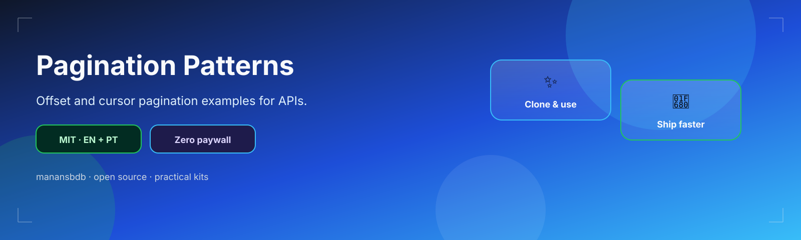
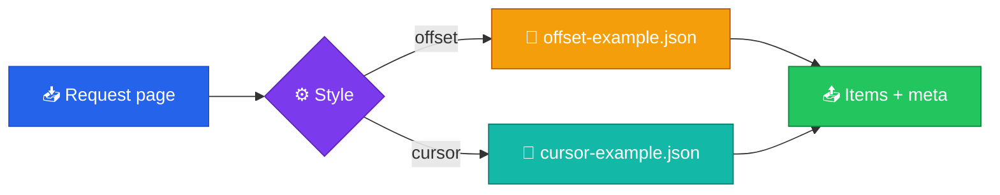

<p align="center">
  
</p>

<h1 align="center">pagination-patterns</h1>

<p align="center">
  <strong>EN</strong> Offset & cursor pagination JSON examples<br/>
  <strong>PT</strong> Exemplos JSON de paginação offset e cursor
</p>

<p align="center">
  <a href="https://github.com/manansbdb/pagination-patterns/blob/main/LICENSE"></a>
  
  
  <a href="#support--apoio"></a>
</p>

---

## What it does / Para que serve

| English | Português |
|---------|-----------|
| Concrete **offset** and **cursor** pagination response examples plus design notes. | Exemplos concretos de paginação **offset** e **cursor** plus notas de design. |
| Pick a style, copy the JSON shape into your API docs. | Escolhe um estilo e copia o JSON para a documentação da API. |



---

## Install / Instalação

### 1) Clone / Clona

```bash
git clone https://github.com/manansbdb/pagination-patterns.git
cd pagination-patterns
```

### 2) Copy examples / Copia exemplos

```bash
mkdir -p docs/api
cp offset-example.json docs/api/
cp cursor-example.json docs/api/
cp notes.md docs/api/pagination-notes.md
```

### Requirements / Requisitos

- `git`
- No runtime dependencies

---

## Quick start / Início rápido

```bash
git clone https://github.com/manansbdb/pagination-patterns.git
# compare offset-example.json vs cursor-example.json → adopt one
```

---

## Contents / Conteúdos

| Path | Purpose / Função |
|------|------------------|
| `offset-example.json` | Offset/limit response |
| `cursor-example.json` | Cursor-based response |
| `notes.md` | Trade-offs |
| `SUPPORT.md` | Donations / Doações |

---

## Project layout / Estrutura

```text
pagination-patterns/
├── docs/banner.svg
├── offset-example.json
├── cursor-example.json
├── notes.md
├── SUPPORT.md
└── README.md
```

---

## Support / Apoio

Bitcoin donations welcome / Doações em Bitcoin bem-vindas:

```
bc1q0qfnlnxyum9u45stzxe0a7jnhtj4j0usfkqdjw
```

See [SUPPORT.md](./SUPPORT.md).

---

## License / Licença

[MIT](./LICENSE) © 2026 manansbdb
